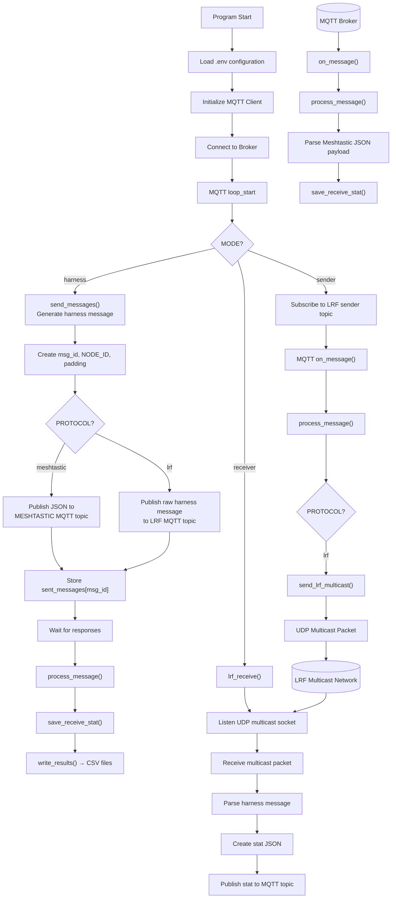

# lora_harness
This harness will work with meshtastic and with other LoRa based firmware to generate messages and harvests stats.



## Setup
### Project

```
# GENERAL
BROKER=
PORT=1883
NODE_ID=101
SLEEP_S=5
TOTAL_MESSAGES=10
TARGET_SIZE=64

# PROTOCOL=lrf
PROTOCOL=meshtastic

MODE=harness
# MODE=sender
# MODE=receiver

# -------------------------------------------------------
# MESHTASTIC
# -------------------------------------------------------
# meshtastic looks for messages to send in MESHTASTIC_SNT_TOPIC_ROOT/2/json/mqtt/!NODE_ID_HEX
MESHTASTIC_SNT_TOPIC_ROOT=msh/EU
# nodes will publish received messages here
MESHTASTIC_RCV_TOPIC_ROOT=msh/EU_SNT
MESHTASTIC_NODE_HEX=6982912c
MESHTASTIC_CHANNEL=ShortFast

# -------------------------------------------------------
# LRF
# -------------------------------------------------------
LRF_MCAST_GROUP=224.0.0.1
LRF_MCAST_PORT=12345
LRF_MCAST_IFACE=192.168.1.10

# the sender will send messages received from LRF_SNT_TOPIC_ROOT/NODE_ID
LRF_SNT_TOPIC_ROOT=lrf/SEND
# nodes will receive messages from here
LRF_RCV_TOPIC_ROOT=lrf/RCV
```

### Meshtastic
Meshtastic firmware is very unstable, I configured things in the following order
* Setup all lora configurations
* setup the mqtt channel in all nodes
  * configure publisher downlink from mqtt channel
  * configured receivers primary channel to uplink
* enable wifi
* enable mqtt connection


