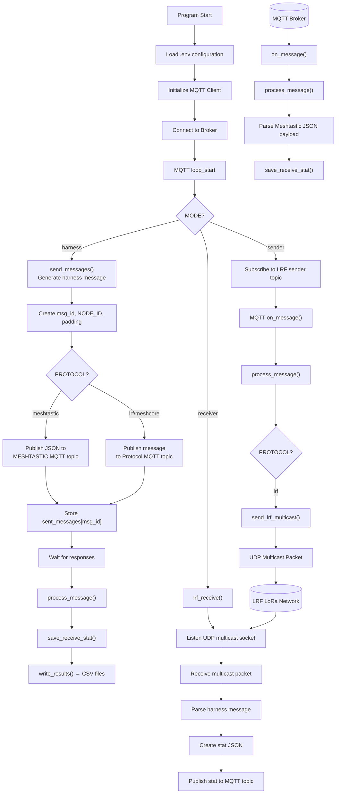

# lora_harness
README UNDER CONSTRUCTION

LoRa Harness
A testing and benchmarking utility for generating messages and harvesting 
performance statistics across multiple LoRa and networking protocols, 
including [Meshtastic](https://meshtastic.org/), [Meshcore](https://meshcore.co.uk/), and LRF (IHMC Radio Framework).

## Architecture Overview
The harness operates in three primary modes: Harness (orchestrator), 
Sender, and Receiver. It utilizes an MQTT broker as the central message 
bus to coordinate between these distributed components.

## Configuration (.env)
Configure the project by creating a .env file in the root directory.

| Variable       | Description                                |
|----------------|--------------------------------------------|
| BROKER         | "MQTT Broker address (e.g., mqtt.ihmc.us)" |
| NODE_ID        | Unique identifier for the current node     |
| SLEEP_S        | Delay between messages in seconds          |
| TOTAL_MESSAGES | Number of messages to send per test run    |
| TARGET_SIZE    | Desired payload size in bytes              |
| PROTOCOL       | "meshtastic, meshcore, or lrf"             |
| MODE           | "harness, sender, or receiver"             |

### Protocol Specifics
* Overhead: The harness does not automatically accounts for overhead added by protocols.

#### Meshtastic
* Topic Structure: Uses msh/EU for sending and msh/EU_SNT for receiving.
* Node ID: Requires MESHTASTIC_NODE_HEX (e.g., 6982912c).
* Notes: JSON output must be enabled in firmware.

#### Meshcore
* Bridge Support: Designed for the meshcore-mqtt bridge.
* Constraint: Use underscores in topics (e.g., meshcore_a) as hierarchical slashes may fail with certain bridge versions.

#### LRF (Custom)
* Used for Ethernet-based simulation/testing via UDP Multicast.
* Group: 224.0.0.1 | Port: 12345

## Setup
### Meshtastic Firmware (v2.7.15)
* To ensure stability during high-throughput testing:
  * Configure LoRa settings and frequency (863MHz).
  * Set Modem Preset to Short Turbo.
  * Set Max Transmit Power to 10dBm.
  * Important: Enable "Duty Cycle Override" and disable encryption to maximize testing transparency.
  * Enable WiFi and MQTT; ensure JSON Output is toggled ON.

### Meshcore (Firmware v1.14.1 - USB Companion)
* Configure nodes via the Meshcore WebApp.
* Trigger "Adv" (Advertisement) from all nodes prior to starting the harness to ensure routing tables are populated.
* MQTT Companion does not fully support hierarchical protocols, that's why we used _a, _b, _c, _d.