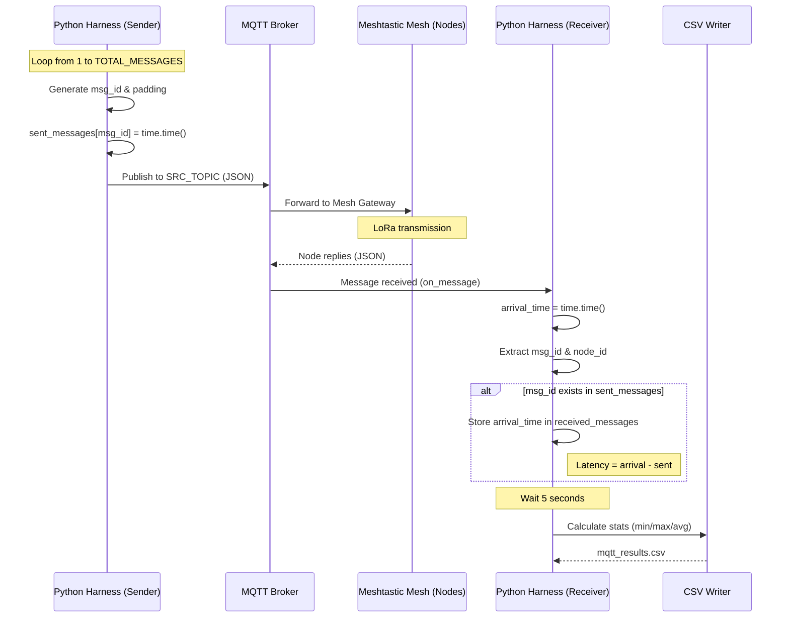

# lora_harness
This harness will work with meshtastic and with other LoRa based firmware to generate messages and harvests stats.



## Setup
### Project
In the root folder of this project create a .env file with the following configurations
* BROKER: Your mqtt broker ex: mqtt.xxx.us
* PORT: Your mqtt port ex: 1883
* ROOT_SRC: Publisher will get messages from here
* ROOT_DST: Receivers will push messages here, MUST BE DIFFERENT FROM ROOT_SRC
* SRC_NODE_HEX: Hex ID of the publisher node (do not include the !).
* CHANNEL: Name of the channel configuration actually used by the nodes (I think default channel is 0 and that's why messages are sent to that channel)
* TOTAL_MESSAGES: How many messages to send
* TARGET_SIZE= Target size of the payload (note that each protocol may add more data)
* NODE_ID: Id of the publisher
* SLEEP_S: Seconds between messages

```
BROKER=
PORT=1883
ROOT_SRC=msh/EU
ROOT_DST=msh/EU_SNT
SRC_NODE_HEX=6982912c
CHANNEL=ShortTurbo
TOTAL_MESSAGES=100
TARGET_SIZE=64
NODE_ID=101
SLEEP_S=5
```

### Meshtastic
Meshtastic firmware is very unstable, I configured things in the following order
* Setup all lora configurations
* setup the mqtt channel in all nodes
  * configure publisher downlink from mqtt channel
  * configured receivers primary channel to uplink
* enable wifi
* enable mqtt connection


